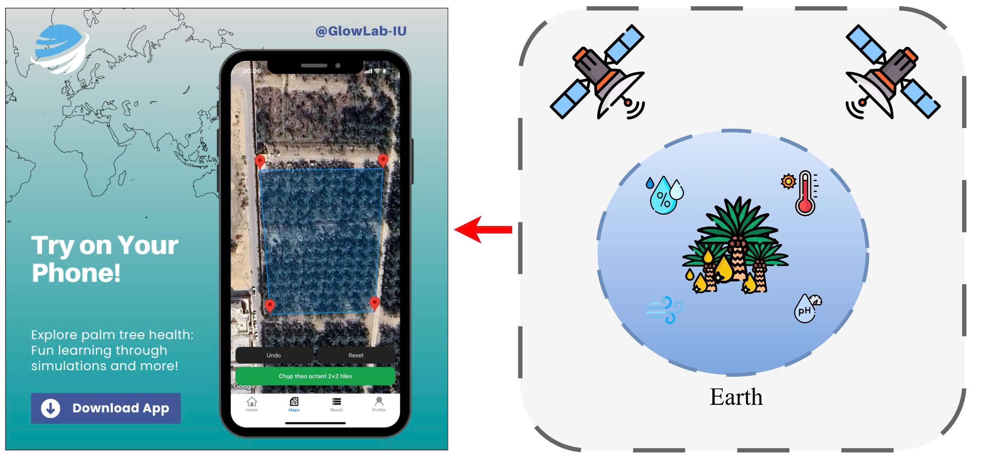
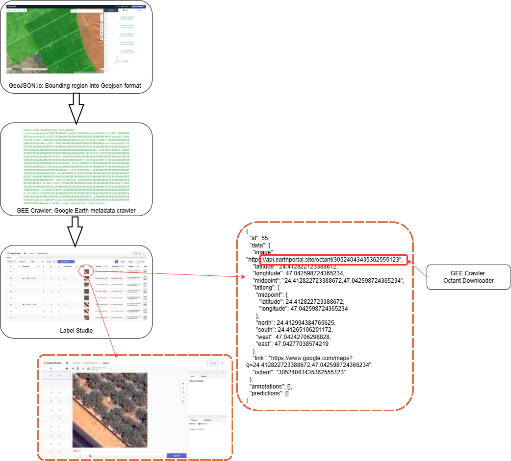
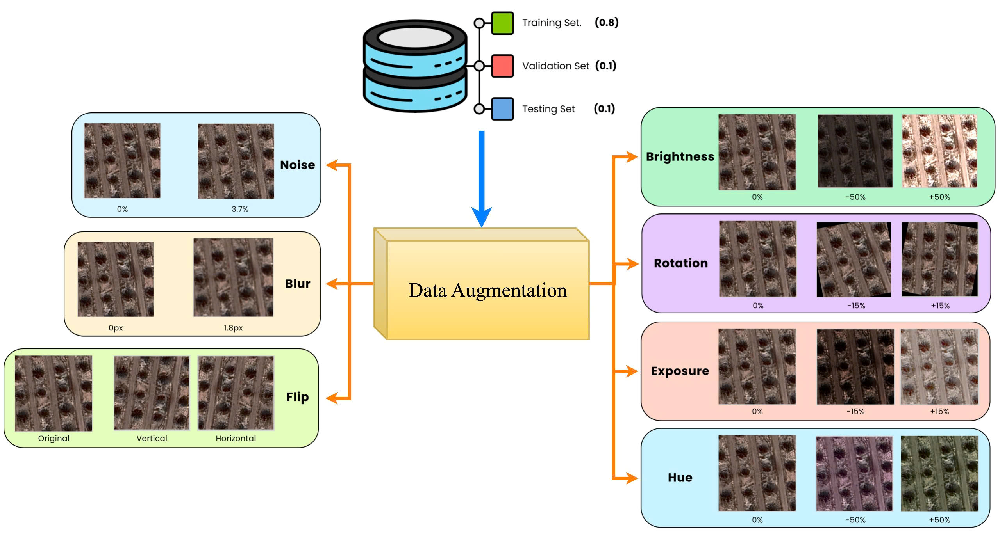
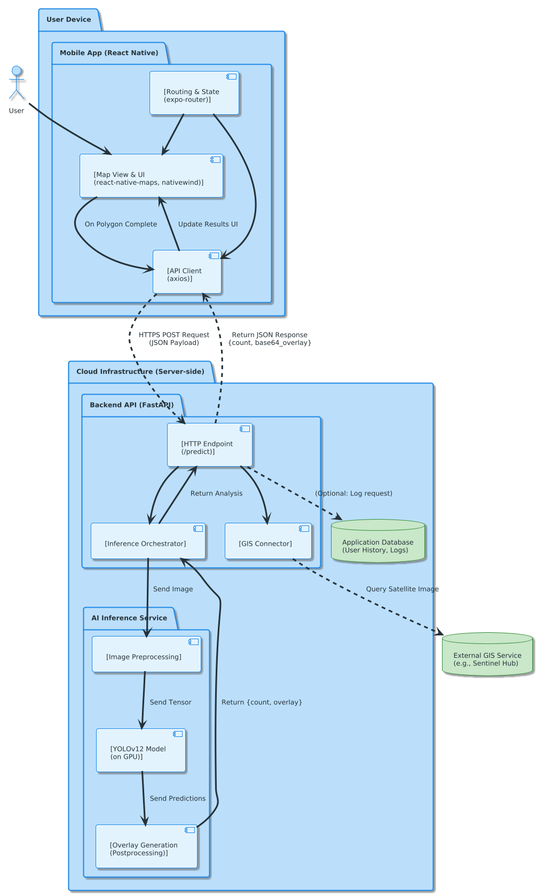
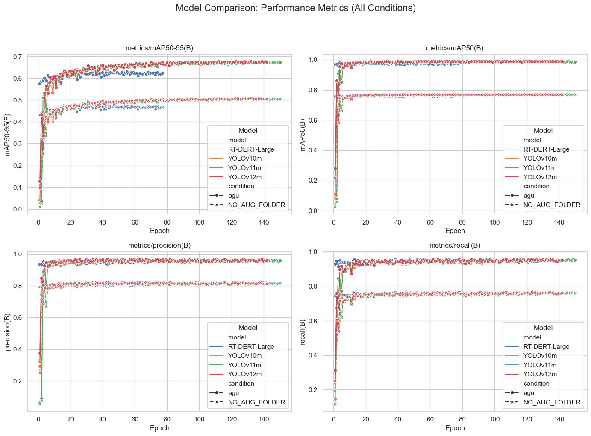
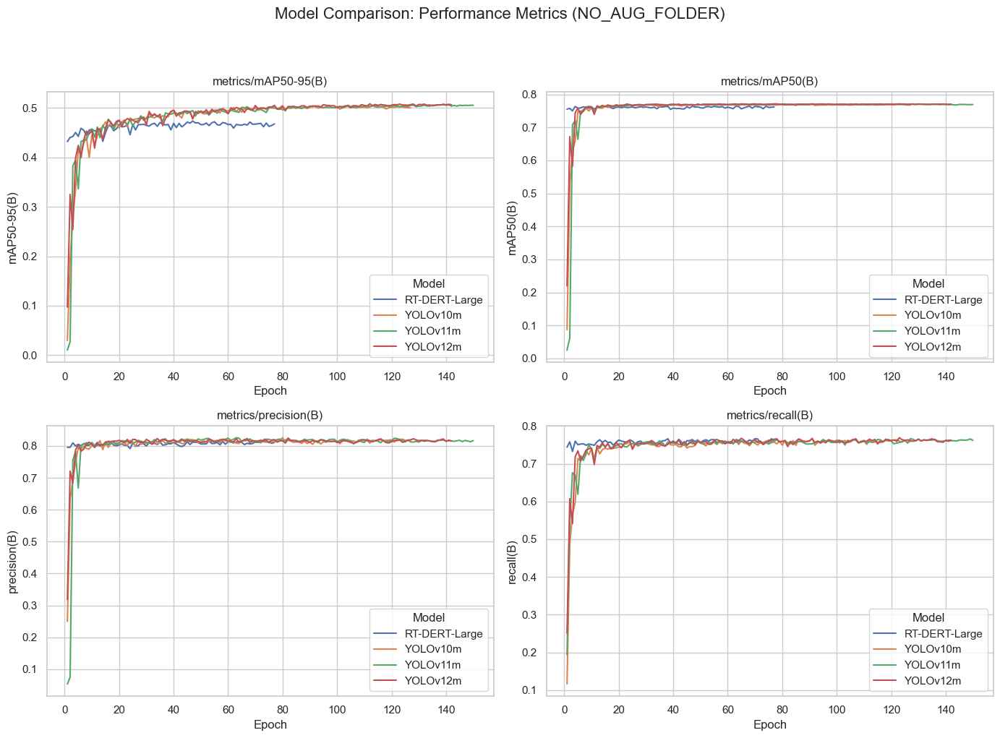

# 🌴 Deep Palm: Satellite-Based Palm Tree Detection Server



[](https://www.python.org/)
[](https://fastapi.tiangolo.com/)
[](https://github.com/ultralytics/ultralytics)
[](https://www.docker.com/)

## 📖 Overview

**Deep Palm Backend** is a high-performance AI inference server designed to revolutionize Precision Agriculture. This project addresses the critical challenge of low-resolution satellite imagery by integrating **State-of-the-Art Object Detection (YOLOv12)** with **Slicing Aided Hyper Inference (SAHI)**.

The server acts as the central intelligence engine: processing geospatial requests, automatically retrieving satellite imagery, and returning actionable agronomic insights (Tree Count, Density, Health Status) in near real-time (~1.7s latency).

### 🚀 Key Features
*   **Satellite Intelligence:** Automatic retrieval of high-resolution imagery via Google Earth Engine / Sentinel Hub.
*   **Deep Tech Core:** Integrates **YOLOv12 + SAHI** to bridge the resolution gap, detecting small palm crowns that standard models miss.
*   **Precision Inventory:** Returns exact GPS coordinates and canopy area ($m^2$) for every single tree (Digital Passport).
*   **Spatial Diagnosis:** Implements a "Traffic Light" system (Green/Yellow/Red) to visually identify overcrowding and optimal spacing.
*   **High Performance:** Built on **FastAPI** (Asynchronous) and containerized with **Docker** for scalable deployment.

---

## 📊 Dataset at a Glance

The dataset used in this study comprises high-resolution RGB satellite tiles collected from diverse agricultural regions.

*   **Regions:** Al-Ahsa, Qassim, Medina (Saudi Arabia).
*   **Resolution (GSD):** 0.3m - 0.5m per pixel.
*   **Splits:** Train (70%), Val (20%), Test (10%) with spatially disjoint partitioning to prevent leakage.
*   **Labeling:** Bounding box annotations localized to palm crowns.


*Samples of RGB satellite imagery used for training and validation.*

---

## 🔬 Methodology

### 1. Image Type Taxonomy and Stratified Handling

To ensure robust generalization across heterogeneous landscapes, we categorized tiles into representative **image types**:

*   **Type A (Dense):** Regular grid patterns, frequent crown overlap, shadowing.
*   **Type B (Sparse):** Widely spaced palms on sandy/rocky backgrounds.
*   **Type C (Mixed):** Palms co-existing with urban structures (buildings, roads).
*   **Type D (Low-contrast):** Haze, shadows, or low solar elevation.

*Note: The dataset stratification ensures balanced exposure to these conditions during training.*

### 2. Type-Aware Processing Workflow

Each tile is tagged during ingestion to trigger type-specific handling, preventing performance inflation from "easy" examples.


*End-to-end workflow: Data ingestion $\rightarrow$ Type tagging $\rightarrow$ Stratified training $\rightarrow$ SAHI Inference.*

### 3. Preprocessing & Augmentation Policy

We apply targeted augmentations to address specific failure modes per image type.


*Illustration of data augmentation techniques applied to improve model robustness.*

| Image Type | Main Failure Mode | Emphasized Policy |
| :--- | :--- | :--- |
| **A: Dense** | Occlusion, clustered crowns | Mosaic, Soft-NMS, high overlap |
| **B: Sparse** | Small objects, soil contrast | Contrast normalization, multiscale |
| **C: Mixed** | Urban false positives | Hard-negative sampling, strict labels |
| **D: Haze/Shadow** | Missed detections | CLAHE-like boost, shadow adjustment |

---

## 🏗️ System Architecture

The system follows a modular pipeline from geospatial data acquisition to AI inference.



1.  **Input:** GeoJSON Polygon from Mobile App.
2.  **Preprocessing:** Satellite retrieval & tiling.
3.  **Inference:** YOLOv12 model scans individual slices (SAHI) to detect trees.
4.  **Post-processing:** Merging detections, Soft-NMS (Non-Maximum Suppression), and Density Calculation.
5.  **Output:** JSON Statistics + Base64 Overlay Image.

---

## 📝 Model & Dataset Cards

### Model Card
*   **Architecture:** YOLOv12m (Medium) + SAHI.
*   **Input Resolution:** 640x640 base; Slicing 1280x1280 $\rightarrow$ 640.
*   **Performance:** ~1.7s latency per tile (NVIDIA T4).
*   **Thresholds:** Confidence 0.4, IoU 0.5, Slice Overlap 0.2.

### Dataset Card
*   **Source:** Private Satellite Collection & Sentinel Hub.
*   **Bias Mitigation:** Stratified sampling across Types A-D.
*   **Classes:** `Palm Tree` (Single class).
*   **Total Instances:** >150,000 labeled crowns.

---

## 📊 Results & Performance

We evaluated the model on a held-out test set comprising all image types, demonstrating superior performance over baseline methods.


*Consolidated performance metrics showing detection accuracy across different conditions.*


*Comparative analysis of detection results against other architectures.*

---

## 🛠️ Tech Stack

*   **Language:** Python 3.10+
*   **Web Framework:** FastAPI, Uvicorn/Gunicorn
*   **AI:** PyTorch, Ultralytics YOLOv12, SAHI, OpenCV
*   **Geospatial:** Rasterio, Shapely, GEE API
*   **Infrastructure:** Docker, Docker Compose

---

## 📁 Repository Structure

```text
├── app/                # Main application code (FastAPI)
├── tools/              # Scripts for training, eval, and inference
├── configs/            # Configs for Model, SAHI, and Augmentation
├── docs/images/        # Figures and assets
├── weights/            # Pre-trained model weights
└── requirements.txt    # Dependencies
```

---

## 🔁 Reproducibility

To reproduce the results reported in this study:

### 1. Training
```bash
python tools/train.py --config configs/exp_yolov12m.yaml --seed 42
```

### 2. Evaluation
```bash
python tools/eval.py --weights weights/best.pt --task val
```

### 3. SAHI Inference
```bash
python tools/infer_sahi.py --source data/test_images/ --config configs/sahi.yaml
```

---

## ⚙️ Installation & Setup

### Prerequisites
*   Python 3.10+
*   CUDA-enabled GPU (Recommended)
*   Google Earth Engine / Sentinel Hub Credentials

### Quick Start

1.  **Clone Repo:**
    ```bash
    git clone https://github.com/GlowLab-IU/Palm-Tree-Detection.git
    cd Palm-Tree-Detection
    ```

2.  **Env Config:** Create `.env` file:
    ```env
    PORT=8000
    MODEL_PATH=weights/yolov12_palm_best.pt
    GEE_SERVICE_ACCOUNT=your-service-account...
    ```

3.  **Install:**
    ```bash
    pip install -r requirements.txt
    ```

4.  **Run:**
    ```bash
    uvicorn app.main:app --reload
    ```

### 🐳 Docker Deployment
```bash
docker-compose up -d --build
```
Server available at `http://localhost:8000`.

---

## 📄 License

This project is licensed under the MIT License.

## 🤝 Contributors

**Truong Vo Huu Thien**<sup>a</sup>, **Do Anh Kiet**<sup>b,c</sup>, **Thanh Tuan Thai**<sup>c,d,f</sup>, **Pham Le Duc Thinh**<sup>b,c</sup>, **Nguyen Nhat Truong**<sup>b,c</sup>, **Sulieman Al-Faifi**<sup>e</sup>, **Yong Suk Chung**<sup>d,g,∗</sup>
