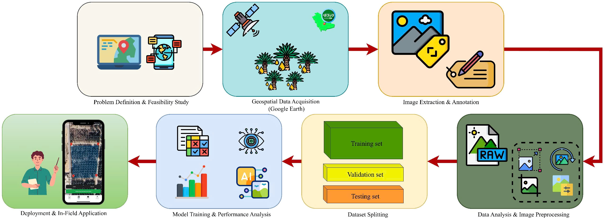
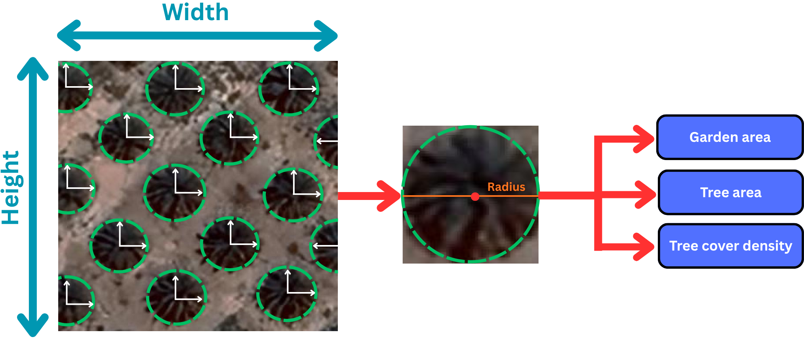
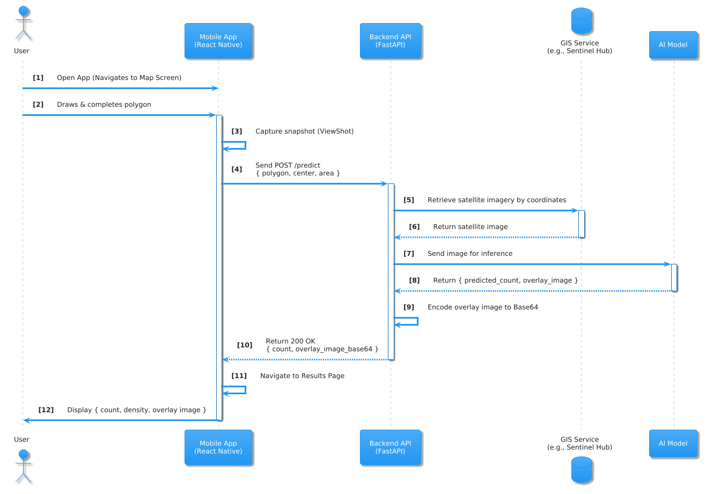

<div align="center">
  
</div>


[](https://www.python.org/)
[](https://fastapi.tiangolo.com/)
[](https://github.com/ultralytics/ultralytics)
[](https://www.docker.com/)

---

## 🔬 Methodology

### 1. Overall Architecture of the Proposed Palm Tree Detection System

The overall workflow of the proposed palm tree detection system is illustrated in **Figure 1**. The architecture is designed as a modular and end-to-end framework that seamlessly integrates geospatial data acquisition, image processing, and deep learning-based object detection. This structure ensures a robust, scalable, and adaptable solution for identifying and monitoring palm trees across diverse landscapes in Saudi Arabia.

At the foundation of this system lies a well-defined sequence of interdependent stages, beginning with **problem definition and feasibility analysis**. In this initial phase, the objectives, operational requirements, and constraints of palm tree detection are established, considering factors such as spatial resolution, regional vegetation density, and environmental variability. The feasibility study provides a conceptual and technical basis for selecting appropriate data sources and designing the computational pipeline.

The second stage, **geospatial data acquisition**, involves the systematic collection of high-resolution satellite imagery from platforms such as **Google Earth**. The focus is to ensure spatial and spectral diversity across different agricultural and desert regions, capturing a representative sample of the various ecological zones within Saudi Arabia.

Next, **image extraction and annotation** are conducted to generate a labeled dataset suitable for training deep learning models. Satellite images are divided into smaller patches, and each palm tree instance is annotated with bounding boxes. These annotations form the essential ground-truth data required for supervised object detection.

The **data analysis and image preprocessing module** aims to enhance the overall quality and consistency of the dataset. This stage includes operations such as color normalization, contrast adjustment, noise reduction, and data augmentation (rotation, scaling, and flipping). These processes help mitigate overfitting and improve the model’s generalization across different illumination and texture conditions.

Following preprocessing, the dataset is **partitioned into training, validation, and testing subsets**, ensuring statistically sound evaluation of model performance. The training set is used to learn object features, the validation set for tuning hyperparameters, and the testing set for final model benchmarking.

The **model training and performance analysis phase** constitutes the computational core of the system. Advanced object detection architectures, such as YOLO or transformer-based models, are trained to recognize palm tree patterns within large-scale satellite imagery. Evaluation metrics, including Precision, Recall, and mean Average Precision (mAP), are employed to assess the system’s accuracy and localization capability under multiple Intersection over Union (IoU) thresholds.

Finally, the **deployment and in-field application stage** operationalizes the trained model, enabling automated palm tree detection from newly acquired imagery. This phase facilitates large-scale monitoring and management of palm plantations, supporting agricultural planning, yield estimation, and environmental assessment initiatives in Saudi Arabia.


*Figure 1: Comprehensive architecture of the proposed palm tree detection system, illustrating the sequential workflow from problem definition to deployment and in-field application.*

### 2. Data Collection

A semi-automatic data acquisition pipeline was employed to collect this dataset, enabling methodical scaling of the collection process while ensuring consistency in geospatial standards and radiometric fidelity. It incorporates high-resolution orthorectified RGB satellite imagery, with a **ground sampling distance (GSD) of 0.5–1.5 m**, captured over key date palm cultivation regions in Saudi Arabia, specifically **Al-Ahsa, Qassim, and Medina**.

These regions were chosen to represent the diversity in geomorphological and climatic conditions across the country. Al-Ahsa is characterized by intensive irrigation and dense groves with strong chlorophyll signatures, while Qassim and Medina, being semi-arid, exhibit sparser canopy cover. Together, these areas provide a comprehensive dataset that captures a broad range of surface textures and landscape contexts typical of Saudi Arabia’s palm agriculture.

The regions of interest were encoded in GeoJSON format and processed through a Dockerized **Google Earth Engine (GEE)** crawler. This system automatically queried high-resolution imagery metadata to generate download URLs and standardized JSON files that described the spatial footprint of each tile. By utilizing remote URL access, the system enabled direct ingestion of imagery into Label Studio, preserving all original metadata and organizing image collection tasks in a systematic manner.


*Figure 2: RGB satellite imagery of date palm plantations in Al-Ahsa, Qassim, and Medina, illustrating diverse farming conditions across Saudi Arabia.*

The imagery was processed to ensure that each palm tree maintained a minimum diameter of 10 pixels at the coarsest resolution, with controlled overlap to avoid duplicate pixels across dataset splits.

### 3. Data Labeling

Annotation targeted the **palm crown** since it is the most stable visual cue in nadir views and correlates with the count of individual trees. A written guideline specified what constitutes a valid crown, how to place boxes for partially occluded crowns, and when to reject ambiguous shapes such as shrubs, circular water structures, or roof features. Annotators worked in a calibrated environment with fixed zoom steps, unified color profiles, and a single class schema. Labels were recorded as axis-aligned bounding boxes with normalized coordinates.

Quality control followed a **two-pass protocol**. The primary pass produced full coverage of all tiles. The audit pass sampled each geographic stratum and inspected both omissions and false inclusions. Disagreements were reconciled by a senior reviewer, and the changes were preserved as versioned commits. Inter-annotator reliability was monitored using intersection over union matching and a minimum agreement threshold. Tiles that failed the threshold were relabeled. An automatic validator then checked for degenerate boxes, out-of-bounds coordinates, and duplicates at tile overlaps. The repository maintains synchronized COCO and YOLO label sets that are generated from a single authoritative source to prevent drift between formats.

### 4. Image Processing

All imagery underwent a standardization routine that aligned radiometry and geometry while preserving crown texture. Corrupted files and tiles with unreadable headers were removed. Channel order was verified and corrected if required. To limit exposure variability across regions and acquisition times, **global illumination was normalized** with histogram alignment computed per region. A shadow-aware adjustment rebalanced intensities in dark zones without flattening edge gradients that delineate crown boundaries. Mild dehazing was applied only to scenes flagged by an automated spectral check for low local contrast.

Geometric consistency was enforced by resampling all tiles to a unified ground sampling distance derived from the corpus median. The resampling method was bilinear interpolation with antialiasing. The target scale guarantees that a typical palm crown spans a comparable pixel diameter across the dataset, which stabilizes anchor selection and receptive field utilization in subsequent detectors. Processing artifacts were monitored with a spatial frequency diagnostic.

### 5. Data Preprocessing

The preprocessing pipeline was developed to standardize image scale, spectral distribution, and annotation consistency. The workflow was fully automated to minimize operator-induced variability and to guarantee reproducibility across experimental runs.

*   **Resizing & Padding:** Each RGB tile was resized to a fixed resolution of **640×640 pixels** using a letterbox method that maintains the original aspect ratio while introducing symmetric padding. Padding pixels were assigned a neutral intensity value.
*   **Normalization:** Pixel intensities were scaled to the normalized range [0,1]. For networks initialized from large-scale natural image pretraining, a channel-wise normalization using the ImageNet mean and standard deviation statistics was applied.
*   **Annotation Integrity:** Bounding boxes were clipped to remain strictly within image boundaries and filtered to satisfy a minimum area threshold. Duplicate annotations introduced by tile overlap were suppressed through an IoU screening separation.
*   **Disjoint Partitioning:** The entire dataset was partitioned into spatially disjoint subsets for training, validation, and testing, with region-level separation to prevent geographic leakage and to produce an unbiased measure of model generalization.

### 6. Data Augmentation

The augmentation pipeline was designed to reproduce the spatial and radiometric variability present in satellite observations while preserving annotation integrity. All transformations were applied on the fly during training.


*Figure 3: Illustration of the data augmentation process and dataset partitioning, showing key transformations applied to satellite tiles for palm tree detection.*

*   **Geometric variability:** Rotations ($\theta \sim U(-8^\circ, 8^\circ)$), translation, scaling ($s \sim U(0.9, 1.1)$), and shear. Horizontal flips are applied, but vertical flips are disabled (canopy orientation tied to gravity/sun).
*   **Photometric robustness:** Controlled HSV jitter (hue, saturation, value), global brightness/contrast perturbation, and low-amplitude Gaussian noise.
*   **Remote sensing specific effects:** Haze simulation, shadow modeling, and sun-glint limiting to handle bright irrigation structures.
*   **Context enrichment:** Mosaic composition, Copy–paste augmentation, and MixUp (decays linearly during final training phase).
*   **Resolution perturbation:** Random downscale–upscale operations to mimic varying GSD.

### 7. Model Training

The model training procedure followed a unified and reproducible pipeline. Three model families were examined: **YOLOv12**, a single-stage anchor-based baseline, and a transformer-based detector (RT-DETR).

*   **Configuration:** Input resolution of 640×640, AdamW/SGD optimizer, cosine learning-rate decay, 150 epochs, batch size 16.
*   **Loss Function:** Compound detection loss comprising Generalized IoU (GIoU), distribution focal loss (DFL), and classification loss.
*   ** Reproducibility:** All runs executed with deterministic seeds, fixed data-loader workers, and identical configurations.

YOLOv12 was selected as the benchmark configuration for subsequent phases due to its optimal balance between localization accuracy and inference speed.

### 8. Accuracy Enhancement using SAHI

To further enhance detection accuracy for small crowns, a **Slicing-Aided Hyper Inference (SAHI)** strategy was integrated.


*Figure 4: Unified Detection Pipeline Integrating YOLOv12 Architecture and SAHI Inference.*

SAHI partitions large-scale satellite images into overlapping tiles (overlap ratio 0.2). Each slice is processed individually at the network’s native resolution, and predictions are merged using **Soft-NMS** in the global coordinate frame. This approach prevents information loss for small objects and significantly improves recall in dense plantations.

### 9. Quantification of Canopy Phenotypes

The framework translates pixel-based detections into actionable metrics using the **Ground Sample Distance (GSD)**.


*Figure 5: Conceptual workflow for feature extraction from satellite imagery.*

*   **Tree Count ($N$):** Total validated palm detections within the Area of Interest (AOI).
*   **Individual Canopy Area ($A_{tree}$):** Derived from the bounding box dimensions assuming a circular approximation: $A_{tree} = \pi r^2$.
*   **Tree Cover Density ($\rho_{cover}$):** The fraction of total plot area covered by palm canopies: $\rho_{cover} (\%) = (A_{cover} / A_{plot}) \times 100$.

### 10. Evaluation Metrics

metrics were computed following the COCO evaluation protocol:

*   **Precision (P) & Recall (R):** Quantify false alarms and missed detections.
*   **mAP@0.5:** Mean Average Precision at IoU threshold 0.5 (localization tolerance).
*   **mAP@0.5:0.95:** Stringent metric averaging AP across multiple IoU thresholds (fine localization).
*   **F1-Score:** Harmonic mean of Precision and Recall.

---

## 🏗️ System Architecture and End-to-End Workflow

The system employs a modular client–server–AI–GIS architecture designed for real-time analysis.


*Figure 6: System architecture illustrating high-level interaction between Mobile App, Backend API, and AI Engine.*

The end-to-end operation follows eight sequential stages:


*Figure 7: Detailed sequence diagram of the data flow, from user interaction to result visualization.*

1.  **Initialization:** User launches app and location services.
2.  **Area Selection:** User defines AOI polygon.
3.  **Data Capture:** Client validates geometry and sends payload.
4.  **API Request:** Backend queries GIS service (Sentinel Hub/GEE).
5.  **Server-Side Processing:** Backend retrieves imagery.
6.  **AI Inference:** YOLOv12 + SAHI processing; bounding box rendering.
7.  **API Response:** JSON response with stats and Base64 overlay.
8.  **Result Display:** Client renders overlay on map.

### Application Design and Use Cases


*Figure 8: Use Case diagram illustrating primary user interactions.*

Core use cases include: **Define Analysis Area**, **Request Analysis**, and **View Analysis Results** (Tree Count, Density, Visual Overlay).

### Component Implementation

*   **Mobile Client:** Developed using **TypeScript + React Native + Expo**. Uses `react-native-maps` for cartography and `nativewind` for styling.
*   **Backend API:** **Python 3.10+** using **FastAPI**. Orchestrates GIS retrieval, SAHI inference, and OpenCV post-processing.
*   **Hardware:** Automatic CUDA acceleration with CPU fallback.


## 📱 Mobile Application Workflow

The mobile application provides a comprehensive workflow for non-expert users.


*Figure 13: End-to-end user workflow: (1) Homepage, (2) Input Verification, (3) Strategic Dashboard, (4) Spatial Analysis Result, (5) Tree Inventory.*

*   **Homepage:** Task initiation.
*   **Input Verification:** Satellite snapshot and environmental data.
*   **Strategic Dashboard:** Tree count, density, and yield forecasts.
*   **Spatial Analysis Result:** Visual overlay with "Traffic Light" status (Red/Green).
*   **Tree Inventory:** Detailed list with GPS coordinates and canopy area.

**Backend Performance:** The total latency ($\approx 1.78s$) enables a near real-time experience, comprising GIS retrieval (~1.2s), SAHI inference (~135ms), and processing (~450ms).

---

## 🛠️ Tech Stack

*   **Language:** Python 3.10+
*   **Web Framework:** FastAPI, Uvicorn/Gunicorn
*   **AI:** PyTorch, Ultralytics YOLOv12, SAHI, OpenCV
*   **Geospatial:** Rasterio, Shapely, Google Earth Engine API
*   **Mobile:** React Native, Expo, NativeWind

---

## 📁 Repository Structure

```text
├── app/                # Main application code (FastAPI)
├── tools/              # Scripts for training, eval, and inference
├── configs/            # Configs for Model, SAHI, and Augmentation
├── docs/images/        # Figures and assets
├── weights/            # Pre-trained model weights
└── requirements.txt    # Dependencies
```

---

## 🔁 Reproducibility

### 1. Training
```bash
python tools/train.py --config configs/exp_yolov12m.yaml --seed 42
```

### 2. Evaluation
```bash
python tools/eval.py --weights weights/best.pt --task val
```

### 3. SAHI Inference
```bash
python tools/infer_sahi.py --source data/test_images/ --config configs/sahi.yaml
```

---

## 🤝 Contributors

**Truong Vo Huu Thien**<sup>a</sup>, **Do Anh Kiet**<sup>b,c</sup>, **Thanh Tuan Thai**<sup>c,d,f</sup>, **Pham Le Duc Thinh**<sup>b,c</sup>, **Nguyen Nhat Truong**<sup>b,c</sup>, **Sulieman Al-Faifi**<sup>e</sup>, **Yong Suk Chung**<sup>d,g,∗</sup>

---

## 📄 License
This project is licensed under the MIT License.
