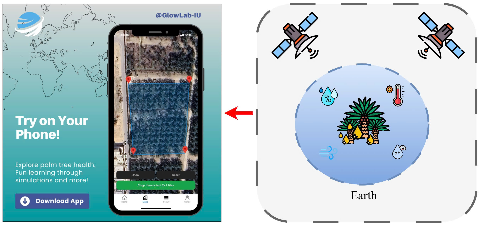

<div align="center">
  
</div>




[](https://www.python.org/)
[](https://fastapi.tiangolo.com/)
[](https://github.com/ultralytics/ultralytics)
[](https://www.docker.com/)

## 🛠️ Tech Stack

*   **Language:** Python 3.10+
*   **Web Framework:** FastAPI, Uvicorn/Gunicorn
*   **AI:** PyTorch, Ultralytics YOLOv12, SAHI, OpenCV
*   **Geospatial:** Rasterio, Shapely, Google Earth Engine API
*   **Mobile:** React Native, Expo, NativeWind

---

## 📁 Repository Structure

```text
├── app/                # Main application code (FastAPI)
├── tools/              # Scripts for training, eval, and inference
├── configs/            # Configs for Model, SAHI, and Augmentation
├── docs/images/        # Figures and assets
├── weights/            # Pre-trained model weights
└── requirements.txt    # Dependencies
```

---

## 🔁 Reproducibility

### 1. Training
```bash
python tools/train.py --config configs/exp_yolov12m.yaml --seed 42
```

### 2. Evaluation
```bash
python tools/eval.py --weights weights/best.pt --task val
```

### 3. SAHI Inference
```bash
python tools/infer_sahi.py --source data/test_images/ --config configs/sahi.yaml
```

---

## 🤝 Contributors

**Truong Vo Huu Thien**<sup>a</sup>, **Do Anh Kiet**<sup>b,c</sup>, **Thanh Tuan Thai**<sup>c,d,f</sup>, **Pham Le Duc Thinh**<sup>b,c</sup>, **Nguyen Nhat Truong**<sup>b,c</sup>, **Sulieman Al-Faifi**<sup>e</sup>, **Yong Suk Chung**<sup>d,g,∗</sup>

---

## 📄 License
This project is licensed under the MIT License.
